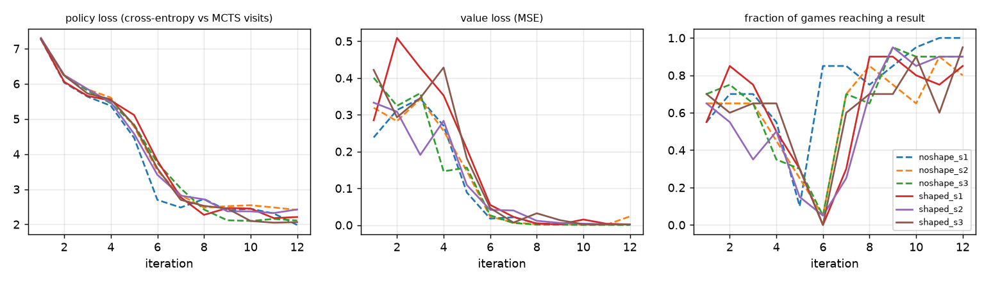

# chess-rl

AlphaZero-style chess: a small policy + value network guides a PUCT Monte Carlo Tree Search, parallel workers generate self-play games, and the network is trained to imitate the search's visit distribution and predict game outcomes. A web viewer shows the current checkpoint playing itself while it trains.

This repo reports what the agent actually achieves, measured against a random-move baseline: after the training budgets tried so far it does **not** beat random play. Details below.

## Algorithm

- **Search**: PUCT MCTS (`chessrl/mcts.py`). Score = −Q(child) + c·prior·√N/(1+n); the network's policy head gives priors, the value head evaluates leaves, terminal positions are scored by the rules. Dirichlet noise at the root during self-play. 48 simulations per move in self-play by default.
- **Network** (`chessrl/model.py`): conv stem → 4 residual blocks of 64 channels → policy head (1×1 conv, linear to 4096) and value head (1×1 conv, MLP, tanh). **2,424,409 parameters.**
- **State** (`chessrl/encode.py`): 17 × 8 × 8 binary planes from the side-to-move's perspective (6 own-piece planes, 6 opponent, 4 castling rights, 1 en passant square). The board is mirrored when black is to move.
- **Actions**: 4096 = from-square × to-square; underpromotions are folded into the queen promotion.
- **Reward**: +1 / −1 at checkmate for the winner / loser, 0 for a draw. Games truncated at 160 plies get a shaped reward, clip(material balance × 0.05, ±0.5), so early training gets a gradient out of long aimless games. `--no-shaping` turns this off.
- **Training** (`train.py`): each iteration, N worker processes play games against the latest checkpoint; the main process then does 2 epochs of Adam (lr 1e-3, batch 512) on policy cross-entropy + 0.5 × value MSE, clips gradients to 1.0, and saves `checkpoints/model.pt` and `checkpoints/stats.json`.

## Usage

```bash
python -m venv .venv && .venv/bin/pip install -r requirements.txt
.venv/bin/python train.py --iters 200 --workers 7 --games-per-worker 4 --sims 48
.venv/bin/python watch.py --port 8000          # live board at http://127.0.0.1:8000
.venv/bin/python eval_vs_random.py --games 100 --sims 32   # strength vs a random mover
.venv/bin/python train_seeded.py --seed 1 --out-dir runs/s1 --fresh --iters 12   # reproducible run (add --no-shaping for the ablation)
```

## Results (measured)

**Long run.** 63 iterations, 2,576 self-play games, 365,803 positions, 79 minutes on 8 CPU cores (no GPU); the checkpoint is `checkpoints/model.pt`. Over training the games went from ~90 % truncated at 160 plies to mostly drawn; value loss fell to ~0.01, policy loss rose from ~0 to ~2.2 as the visit targets became less peaked.

Strength of that checkpoint against a uniformly random mover (20 games, 10 as white, 10 as black, 200-ply cap, draw claims on):

| mode | W / D / L | score |
|---|---|---|
| raw policy (argmax) | 0 / 18 / 2 | 0.45 |
| MCTS, 32 simulations | 0 / 18 / 2 | 0.45 |
| random vs random | 0 / 20 / 0 | 0.50 |

**Seeded runs, 3 seeds × {shaped reward, no shaping}.** 12 iterations each from a fresh network, 5 workers × 4 games, 48 sims (240 games per run), on the same 8-core machine while it was shared with another job.



| run | final policy loss | final value loss | games reaching a result at iter 12 | iterations to "convergence" |
|---|---|---|---|---|
| noshape seed 1 | 1.984 | 0.0011 | 100 % | 6 |
| noshape seed 2 | 2.410 | 0.0236 | 80 % | 11 |
| noshape seed 3 | 2.111 | 0.0003 | 90 % | 9 |
| shaped seed 1 | 2.210 | 0.0019 | 85 % | 8 |
| shaped seed 2 | 2.425 | 0.0017 | 90 % | 9 |
| shaped seed 3 | 2.065 | 0.0017 | 95 % | never |

"Convergence" here is defined as the first iteration at which at least 80 % of self-play games end by the rules (mate, stalemate, repetition, 50-move, insufficient material) rather than being truncated, for two consecutive iterations. That happens in 6–11 iterations, but it is convergence to *draws*: the value target becomes almost constant, which is why the value loss goes to zero. It is not convergence to strength.

Strength of each final checkpoint vs random (40 games each, 95 % Wilson interval on the score):

| run | raw policy W/D/L | MCTS-32 W/D/L |
|---|---|---|
| noshape seed 1 | 0 / 39 / 1 | 0 / 36 / 4 |
| noshape seed 2 | 0 / 37 / 3 | 0 / 36 / 4 |
| noshape seed 3 | 1 / 36 / 3 | 0 / 38 / 2 |
| shaped seed 1 | 0 / 34 / 6 | 1 / 36 / 3 |
| shaped seed 2 | 0 / 37 / 3 | 0 / 36 / 4 |
| shaped seed 3 | 0 / 38 / 2 | 0 / 35 / 5 |

Two wins in 480 games; every score interval includes 0.5. Reward shaping makes no measurable difference at this budget. The honest summary: the pipeline runs end to end and the losses behave as the AlphaZero recipe predicts, but with CPU-only self-play (tens of games per iteration, 48 simulations) the network has not learned to convert material into wins, so it plays at random-mover strength.

## Known limitations

- Self-play is CPU-bound and single-threaded per worker: roughly one game per worker per 10–20 s. AlphaZero-scale results need orders of magnitude more games.
- Policy space folds underpromotions into the queen promotion.
- The 160-ply truncation plus material shaping is a heuristic; without it almost all early games are truncated.
- No replay buffer across iterations: each iteration trains only on the games just played.

## Layout

```
chessrl/encode.py    board and move encoding
chessrl/model.py     policy + value network
chessrl/mcts.py      PUCT search
chessrl/selfplay.py  self-play game generation (worker entry point)
train.py             training loop
train_seeded.py      train.py with --seed, --out-dir, --fresh, --no-shaping
eval_vs_random.py    strength vs a random mover, with a Wilson interval
watch.py             live self-play viewer
checkpoints/         model.pt (iteration 63) and stats.json
docs/                learning curves of the seeded runs
```

---

<sub>Wael Alzoubi · [mini-os32](https://github.com/Waelalzoub1/mini-os32) · [custom-16bit-CPU](https://github.com/Waelalzoub1/custom-16bit-CPU) · [Transformer-character-level](https://github.com/Waelalzoub1/Transformer-character-level)</sub>
